# Домашнее задание: Практическое применение Docker

## Задача 0

Старый `docker-compose` не установлен. Использую `docker compose` версии `2.40.3`.

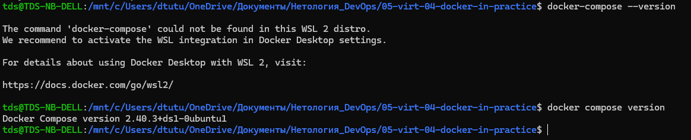

## Задача 1

Добавил [Dockerfile.python](https://github.com/dtutu-tds/shvirtd-example-python/blob/main/Dockerfile.python) на основе `python:3.12-slim`. Использовал multistage-сборку, `COPY . .` и команду запуска из задания. Ненужные файлы добавил в `.dockerignore`.

Образ успешно собрался.

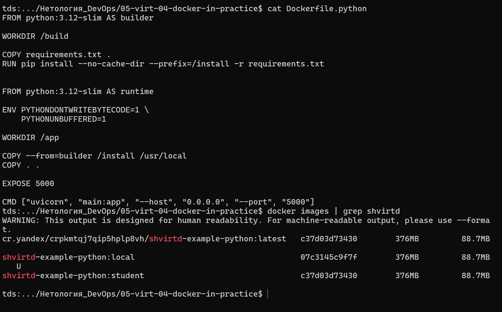

## Задача 2 (*)

В Yandex Cloud создал Container Registry `test`. Настроил аутентификацию Docker, собрал образ и загрузил его в registry.

```text
cr.yandex/crpkmtqj7qip5hplp8vh/shvirtd-example-python:latest
```

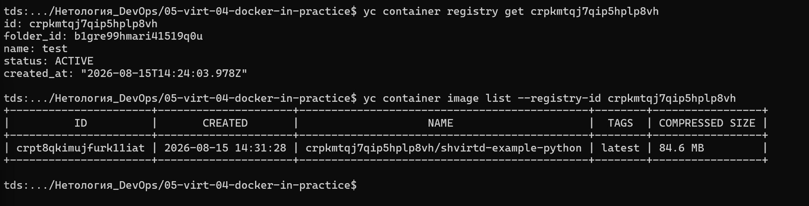

Запустил сканирование образа на уязвимости.

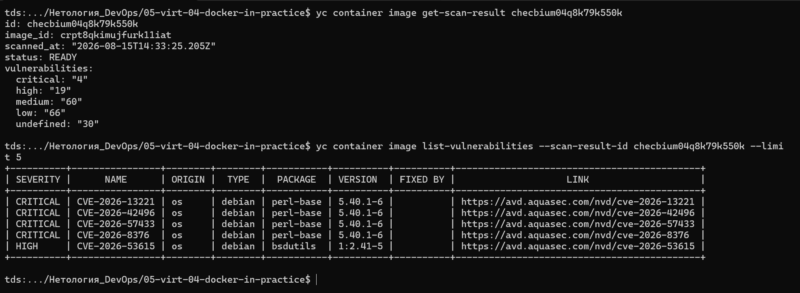

## Задача 3

В [compose.yaml](https://github.com/dtutu-tds/shvirtd-example-python/blob/main/compose.yaml) подключил `proxy.yaml` через `include`. Для `web` указал адрес `172.20.0.5`, для `db` адрес `172.20.0.10`. Оба сервиса находятся в сети `backend`.

Пароли берутся из `.env`. Сам файл в Git не добавлял.

После запуска `curl` вернул время и IP-адрес.

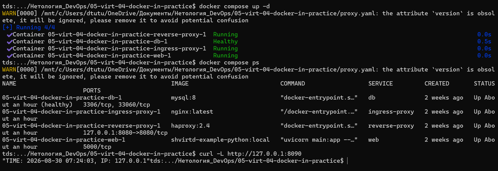

Подключился к MySQL и проверил базу `virtd`, таблицу `requests` и записи в ней.

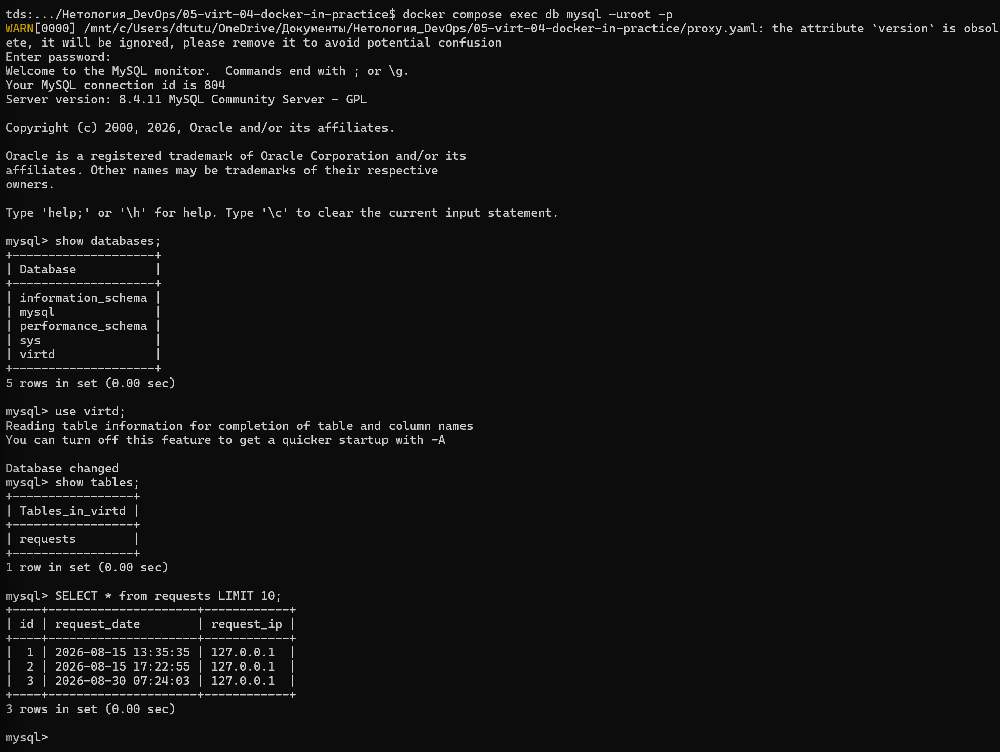

## Задача 4

В Yandex Cloud создал прерываемую ВМ с 2 vCPU, 2 ГБ RAM и диском 10 ГБ.

Код находится в репозитории [shvirtd-example-python](https://github.com/dtutu-tds/shvirtd-example-python). Для установки Docker и запуска проекта написал [deploy.sh](https://github.com/dtutu-tds/shvirtd-example-python/blob/main/deploy.sh). Проект развёрнут в `/opt/shvirtd-example-python`.

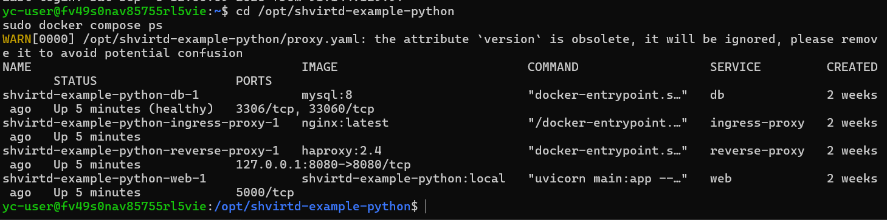

Проверил адрес `http://158.160.135.237:8090` через [Check-Host](https://check-host.net/check-report/4a21bd93k64e). Внешние узлы получили ответ `200 OK`.

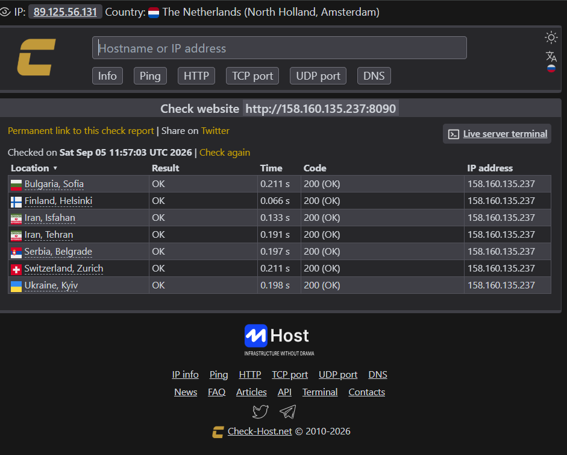

На ВМ повторно проверил таблицу `requests`. В ней появились обращения к приложению.

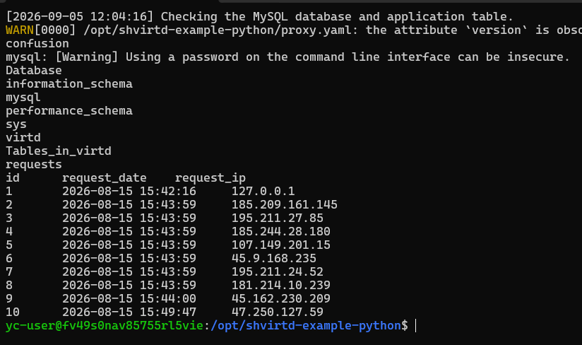

## Задача 5 (*)

В [deploy.sh](https://github.com/dtutu-tds/shvirtd-example-python/blob/main/deploy.sh) добавил резервное копирование MySQL через образ `schnitzler/mysqldump`. Дампы сохраняются в `/opt/backup`.

Пароль в `deploy.sh` не записывал. Скрипт читает значения из существующего `.env`. Ручной запуск проверил. Запуск по расписанию настроил через `systemd timer` раз в минуту.

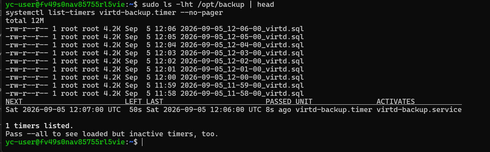

## Задача 6

Скачал образ Terraform и сохранил его в архив.

```bash
docker pull hashicorp/terraform:latest
docker save -o terraform-image.tar hashicorp/terraform:latest
```

Открыл архив в Dive и нашёл слой с файлом `/bin/terraform`.

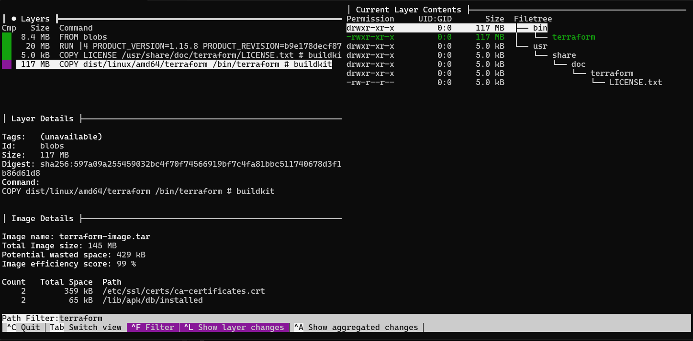

Извлёк файл на локальную машину и проверил версию.

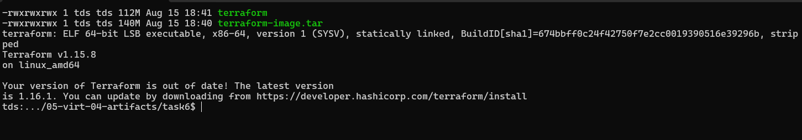

## Задача 6.1

Повторил копирование через `docker cp`.

```bash
docker create --name terraform-copy-homework --entrypoint /bin/sh hashicorp/terraform:latest
docker cp terraform-copy-homework:/bin/terraform ./terraform-docker-cp
docker rm terraform-copy-homework
chmod +x terraform-docker-cp
./terraform-docker-cp version
```

Контрольные суммы обоих файлов совпали.

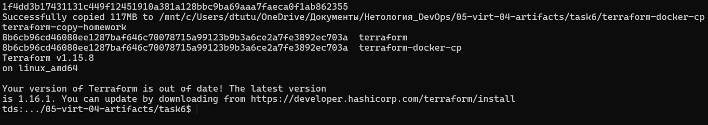

После выполнения задания ВМ остановил.
